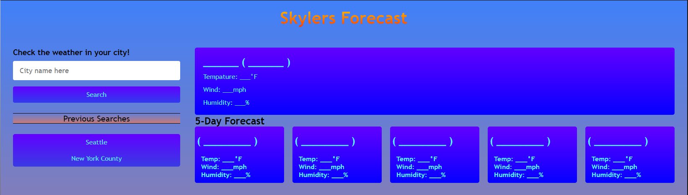
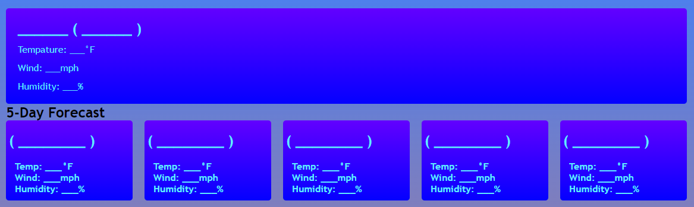
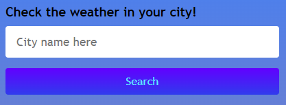
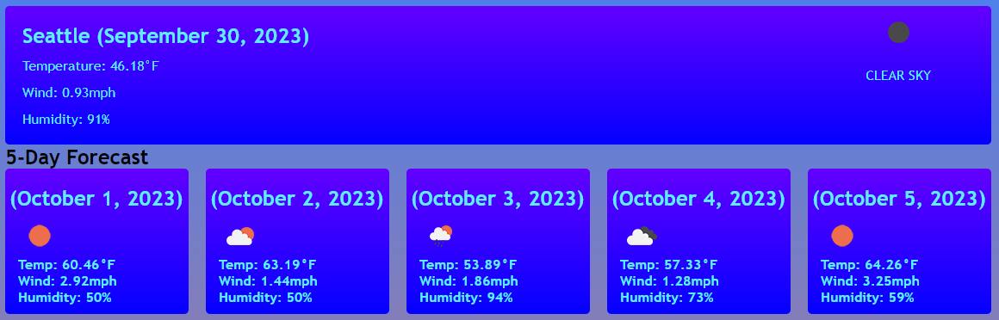
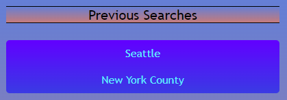

Welcome to my forecast page!
Using my forecast webpage is super simple! This will be the screen your met with when you launch the site!

The middle and 5 day forecast will be empty, waiting for you to type in a city youd like to know the weather of!

The left side is where you have the space to input a city name and hit search!

Once you've decided on your city and hit search the feilds will automatically fill in!

Underneath the seach section you will have the previous searches section! 
Clicking on any of your previous searches will display the weather of that search!

Dont worry! Refreshing the tab or even closing the browser wont lose your previous searches!
Thanks for viewing my page!